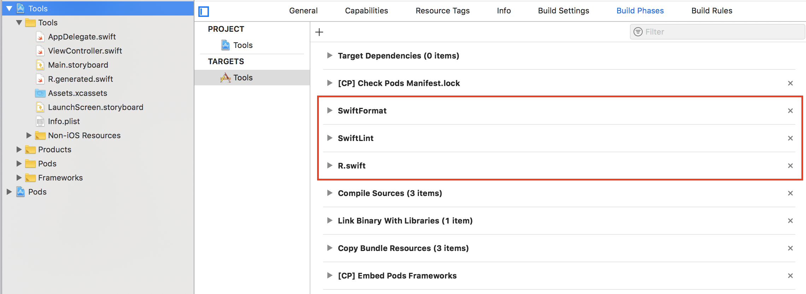

# Xcode Templates

This repository contains useful Xcode templates to simplify new projects up and running.

## Installation

Clone this project and navigate to it via terminal. Run install script:

    chmod +x install_main_ios_app_template.sh
    ./install_main_ios_app_template.sh

This script will copy MainApp project template to `~/Library/Developer/Xcode/Templates/Project Templates/MainApp` where Xcode will be able to find it. 

    chmod +x install_main_network_ios_app_template.sh
    ./install_main_network_ios_app_template.sh

This script will copy MainApp project template for networking to `~/Library/Developer/Xcode/Templates/Project Templates/MainApp` where Xcode will be able to find it. 

    chmod +x install_empty_swift_file_template.sh
    ./install_empty_swift_file_template.sh

This script will copy empty file template to `~/Library/Developer/Xcode/Templates/File Templates/Source` where Xcode will be able to find it. 

## Templates usage

### Empty Swift File Template

This template creates blank Swift file without headers and imports. 

### Main iOS App Template

This template creates iOS project with [MVP](https://medium.com/@saad.eloulladi/ios-swift-mvp-architecture-pattern-a2b0c2d310a3) structure with some useful features:

* `.gitignore` file;
* [SwiftLint](https://github.com/realm/SwiftLint) build phase integration and configuration file;
* [SwiftFormat](https://github.com/nicklockwood/SwiftFormat) build phase integration;
* [R.Swift](https://github.com/mac-cain13/R.swift) build phase integration;
* `Podfile` to install all the tools mentioned above;
* [Generamba](https://github.com/strongself/Generamba) code generator;
* `Gemfile` to install Generamba and Cocoapods.

#### Up and running

1. Open Xcode and create new project, choose *Main iOS App Template* from the wizard (at the *Private* section);
2. Configure project name and other parameters as usual;
3. Close project, navigate to it via terminal and run `bundle install` to install gems. If you have no *Bundler* installed - welcome here https://bundler.io/
4. Run `pod install` to install pods;
5. Open the generated workspace, navigate to *Build Phases* of your project's main target and **move the SwiftFormat, SwiftLint, and R.Swift script phases above the compile phase** (exactly that order). We have to make this step manually due to limitations of Xcode templates;
   
6. Remove automaticaly generated tests boilerplate file `{project_name}Tests\{project_name}Tests.swift`
6. Configure Generamba and setup templates: `generamba template install`
7. Build project

### MainApp iOS Network App Template

Template inherits MainApp iOS App Template and includes pods (like [Moya](https://github.com/Moya/Moya) and [SDWebImage](https://github.com/SDWebImage/SDWebImage)) and classes for networking. Project initializations steps the same. Use this template when your app requires server comunication.
